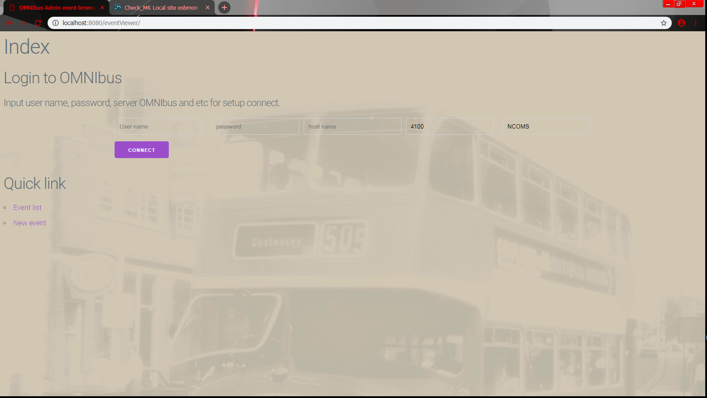
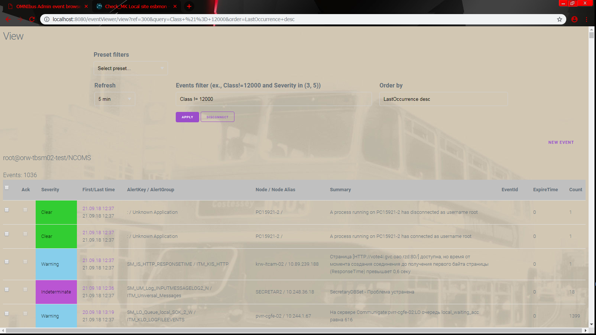

# omniViewer
OMNIbus event Viewer with out Java plugin in client

# Common information

This application is run on the local machine or on the application server,
for example tomcat, and allows you to work with the IBM Netcool / OMNIbus
event server throught the clear browser (without java plugin).

Main functions

- view the filtered list of events
- view event details
- modify events
- create your own events
- massively change the severity and confirm events

More detail information by english will be later.
Russian instruction into [folder Doc](omniViewerCommon/Doc/README.md)

# Screens

Example screens
[More screenshots](omniViewerCommon/screenshots/)

## Connect panel

## Event list

View list 1

